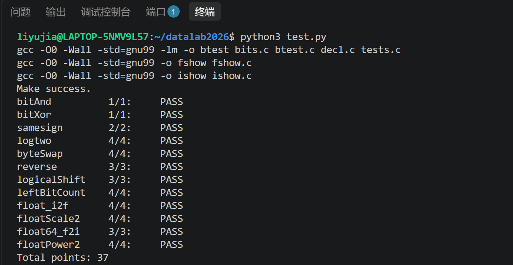

# datalab 报告

姓名：李宇佳

学号：2025201465

## 测试成绩

**总分：37/37**

| 函数 | 得分 | 函数 | 得分 |
|---|---|---|---|
| bitAnd | 1/1 | bitXor | 1/1 |
| samesign | 2/2 | logtwo | 4/4 |
| byteSwap | 4/4 | reverse | 3/3 |
| logicalShift | 3/3 | leftBitCount | 4/4 |
| float_i2f | 4/4 | floatScale2 | 4/4 |
| float64_f2i | 3/3 | floatPower2 | 4/4 |

**test 截图：**

## 解题报告

### 亮点

1. **byteSwap**：利用异或差异直接交换两个字节，省去清空原字节、重新填入的过程。
2. **logtwo**：通过 16、8、4、2、1 的分块定位最高有效位，用比较运算代替条件分支，并用按位或组合最终结果。
3. **leftBitCount**：使用动态右移定位待检查的位段，避免对负数进行左移。
4. **float_i2f**：通过位运算实现整数到单精度浮点数的转换，并处理有效位截断与就近舍入。

### 1. bitAnd

**核心思路：德摩根定律。**

题目要求仅使用 `~` 和 `|` 实现 `x & y`，因此利用德摩根定律进行转换：

`x & y = ~(~x | ~y)`

首先对 `x` 和 `y` 分别取反，再进行按位或，最后对结果整体取反。

从单个二进制位来看，只有当原来的两个对应位都是 1 时，取反后的对应位才都是 0，此时按位或结果为 0，再次取反后得到 1。其余情况下结果均为 0，与按位与运算的规则一致。

整个表达式使用 3 次取反和 1 次按位或，共 4 次运算，符合题目限制。

### 2. bitXor

**核心思路：排除两个对应位相同的情况。**

异或的定义是两个二进制位不同时结果为 1，相同时结果为 0。因此，可以将问题转化为同时排除“两个对应位都是 1”和“两个对应位都是 0”的情况。

首先，`x & y` 找出两个对应位同时为 1 的位置，取反后得到 `~(x & y)`，排除了两位同时为 1 的情况。

其次，`~x & ~y` 找出原来两个对应位同时为 0 的位置，取反后得到 `~(~x & ~y)`，排除了两位同时为 0 的情况。

最后对两部分进行按位与：

`~(x & y) & ~(~x & ~y)`

只有当两个对应位不同，即分别为 0、1 或 1、0 时，两部分才同时为 1，从而实现异或运算。

### 3. samesign

**核心思路：先处理 0，再通过异或后的符号位判断。**

本题需要特别处理 0，因为题目规定 0 既不是正数也不是负数，只有两个数同时为 0 时才返回 1。

首先通过 `!x` 判断 `x` 是否为 0。如果 `x=0`，则直接返回 `!y`，只有 `y` 也为 0 时结果才为 1。如果 `x` 不为 0 而 `y=0`，则返回 0。

排除 0 后，两个操作数均为非零整数，可以直接比较它们的符号位。

在 32 位补码表示中，bit31 是符号位。对 `x` 和 `y` 进行按位异或 `x ^ y`，如果两者符号相同，异或结果的最高位为 0；如果符号不同，最高位为 1。

再将结果算术右移 31 位。如果符号相同，结果为 0；如果符号不同，结果为 -1。因此使用：

`!((x ^ y) >> 31)`

即可将符号相同转换为返回 1，符号不同转换为返回 0。

### 4. logtwo

**核心思路：分块定位最高有效位，并记录每次右移的距离。**

对于正整数 `v`，其以 2 为底的对数向下取整，等于二进制表示中最高有效位 1 的位置。因此本题可以转化为寻找最高有效位的编号。

由于不能使用循环和加法，采用类似二分查找的方法，依次按照 16、8、4、2、1 位缩小查找范围。

第一步通过 `(v >> 16) > 0` 判断最高有效位是否位于 bit16 及以上。如果结果为 1，说明可以直接右移 16 位；否则不需要移动。

为了避免使用条件分支，将比较结果左移 4 位，使其变成 0 或 16：

`a = ((v >> 16) > 0) << 4`

然后执行 `v = v >> a`，同时将本次移动距离记录在 `a` 中。

后续依次按照相同的方法检查 8、4、2 位，得到变量 `b`、`c`、`d`，分别记录 0 或 8、0 或 4、0 或 2 的移动距离。

经过这四轮后，剩余数值的最高有效位只可能在 bit0 或 bit1，因此最后使用 `e = v >> 1` 得到剩余位置。

最终，最高有效位在原整数中的位置等于所有移动距离之和。

由于 16、8、4、2、1 的二进制表示分别为 `10000`、`01000`、`00100`、`00010`、`00001`，这些数的 1 位互不重叠，因此可以用 `a | b | c | d | e` 代替加法组合结果。

例如，若最高有效位位于 bit13，定位过程中可以依次移动 8 位、4 位，最后剩余 1 位，于是得到 `8 | 4 | 1 = 13`。

### 5. byteSwap

**核心思路：提取两个字节的异或差异，再利用异或的可逆性实现交换。**

题目要求交换 32 位整数中编号为 `n` 和 `m` 的两个字节，其余字节保持不变。

一个字节包含 8 位，因此首先使用 `n << 3` 和 `m << 3` 计算两个字节的起始位偏移量，并分别保存到 `ns` 和 `ms` 中。

随后将原数分别右移对应偏移量，使目标字节移动到最低 8 位，并计算两个字节的异或差异：

`diff = ((x >> ns) ^ (x >> ms)) & 0xFF`

其中，`0xFF` 用于只保留最低 8 位，使 `diff` 仅包含两个目标字节之间的差异。

设两个原始字节分别为 A、B，则 `diff = A ^ B`。利用异或运算的性质：

`A ^ (A ^ B) = B`

`B ^ (A ^ B) = A`

可以发现，只需将相同的差异值 `diff` 分别与原来的两个字节异或，就能够把它们变成对方的值。

因此，将 `diff` 分别左移到原来两个字节的位置，再与 `x` 异或：

`x ^ ((diff | 0u) << ns) ^ ((diff | 0u) << ms)`

由于 `diff` 只有最低 8 位可能非零，移动之后只会改变对应的目标字节，不会影响其他位置。

这里额外使用 `diff | 0u`，不会改变差异值本身，但可以使后续左移按照无符号运算执行，避免在移动到最高字节时出现有符号左移溢出。

相比先清除两个字节、再将交换后的字节重新填入的做法，这种方法不需要构造额外的清零掩码，减少了操作次数。

当 `n=m` 时，差异值为 0，结果自然保持不变。

### 6. reverse

**核心思路：从低位依次取出 bit，再按相反顺序构造结果。**

本题要求将一个 32 位无符号整数的所有二进制位顺序反转。

使用无符号变量 `result` 保存反转结果，初始为 0。由于题目允许循环，因此采用固定 32 次的逐位处理方法。

每次循环首先通过 `v & 1` 取出 `v` 的最低有效位。

随后执行：

`result = (result << 1) | (v & 1)`

其中，`result << 1` 将已经构造好的结果整体左移一位，在最低位空出位置；再通过按位或，将刚取出的 bit 添加到最低位。

最后执行 `v = v >> 1`，使原来的下一位移动到最低位，供下一次循环提取。

由于原整数的 bit0 最先被取出，而结果变量每次都会左移，因此最早取出的 bit 会逐渐被推向结果的最高位，最后取出的 bit 则停留在最低位。

例如，对于简化的 4 位数 `1011`，依次取出最低位得到 1、1、0、1，逐次拼接后得到 `1101`，完成反转。

本题使用 `unsigned` 类型，右移时高位补 0，避免符号扩展影响结果。

### 7. logicalShift

**核心思路：先进行算术右移，再构造掩码清除高位补入的 1。**

本题要求实现逻辑右移，即右移 `n` 位后，左侧空出来的部分全部补 0。

在实验采用的环境中，有符号整数 `x` 右移时，如果最高位为 1，会进行符号扩展，在左侧补入 1。因此需要使用掩码，将这些多余的高位 1 清除。

对于 `n>0` 的情况，目标掩码应该是最高 `n` 位为 0、剩余低位全部为 1。

首先使用常量 `0x7FFFFFFF`，其二进制最高位为 0，其余 31 位为 1。

当 `n>0` 时，将其右移 `n-1` 位，就能得到所需掩码。例如 `n=4` 时，将 `0x7FFFFFFF` 右移 3 位，得到 `0x0FFFFFFF`，恰好最高 4 位为 0，其余位为 1。

代码中使用：

`n + !n + ~0`

计算移位量。因为 `~0 = -1`，所以当 `n>0` 时，`!n=0`，结果为 `n-1`。

当 `n=0` 时，`!n=1`，移位量为 0。但此时第一部分得到的是 `0x7FFFFFFF`，而逻辑右移 0 位应该保持原数不变，因此需要全 1 掩码。

为此，代码通过：

`(~0x7FFFFFFF) & (~((!n) + ~0))`

构造补充部分。

其中，`~0x7FFFFFFF` 只有最高位为 1。当 `n=0` 时，右侧表达式得到全 1，因而能够补上最高位；当 `n>0` 时，右侧表达式为 0，不会影响原有掩码。

将两部分按位或组合后，得到完整的 `mask`。

最后执行 `(x >> n) & mask`，在保留右移后有效数字的同时清除高位符号扩展产生的 1，实现逻辑右移。

这种实现还避免了直接使用 `1 << 31` 以及对负数进行左移所带来的未定义行为风险。

### 8. leftBitCount

**核心思路：按照 16、8、4、2、1 位分块检查，并利用累计数量动态确定下一次检查的位置。**

本题要求统计一个 32 位整数从最高位开始连续出现的 1 的数量，遇到第一个 0 后立即停止计数。

由于不能使用循环和条件分支，采用分块检查的方法，先检查最高 16 位，再依次检查后续的 8、4、2、1 位。

第一步使用：

`a = (!~(x >> 16)) << 4`

判断最高 16 位是否全部为 1。

如果最高 16 位全为 1，那么在算术右移 16 位之后，结果仍然全为 1，即 -1。此时按位取反得到 0，再使用逻辑非得到 1。

因此 `!~(x >> 16)` 可以判断最高 16 位是否全部为 1，左移 4 位后得到 16 或 0。将该结果保存到 `count`，表示已经确认的连续 1 数量。

接下来需要检查后续 8 位。由于第一步可能已经确认 16 位，也可能一位都没确认，因此下一次检查的位置必须根据 `count` 调整。

代码使用：

`b = (!~(x >> (24 + ~count + 1))) << 3`

其中，`~count + 1` 相当于 `-count`，因此右移距离为 `24-count`。

如果 `count=0`，说明最高 16 位不全为 1，下一步继续检查最高 8 位，右移 24 位即可。

如果 `count=16`，说明最高 16 位已经全部确认为 1，下一步应检查 bit15～bit8，右移 8 位即可。

由于更高位置已经确认为 1，因此只要当前检查的 8 位也是全 1，算术右移结果就会是 -1，可以继续使用 `!~` 判断。

然后将结果转换为 0 或 8，累加到 `count`。

后续对 4 位、2 位和 1 位采用相同方法，基础右移距离分别为 28、30、31，每次再减去已经确认的连续 1 数量。

这样，`count` 始终记录当前已经确认的连续 1 数量，同时用于定位下一块还没有检查的二进制位。

最后还需要处理 `x=-1` 的情况。由于全部 32 位都是 1，而分块数量 `16+8+4+2+1` 最多只能统计 31 位，因此使用 `all = !~x` 判断原数是否全为 1，并在最终结果中额外加上 `all`。

最终返回 `count+e+all`，得到最高连续 1 的总数。

相比直接将原数左移、丢弃已检查部分的方式，这种实现始终保留原始 `x`，只调整右移距离，避免了对负数进行左移可能产生的未定义行为。

### 9. float_i2f

**核心思路：按照 IEEE 754 单精度浮点数格式分别构造符号位、阶码和尾数，并处理舍入。**

本题要求将一个 32 位有符号整数转换为 IEEE 754 单精度浮点数的二进制编码，返回值虽然是 `unsigned`，但实际表示的是浮点数的 32 位 bit pattern。

单精度浮点数由 1 位符号位、8 位阶码和 23 位显式尾数组成。

首先通过 `ux & 0x80000000` 提取符号位。如果 `x=0`，直接返回 0；如果 `x` 为负数，则通过 `~ux+1` 得到其绝对值的无符号表示，便于后续统一处理。

随后通过循环不断将临时变量 `tmp` 右移，直到其最高有效位移动到 bit0，使用变量 `p` 记录累计移动次数。

由于一个正整数可以规格化表示为 `1.xxxxx × 2^p`，因此 `p` 就是实际指数。单精度浮点数采用偏置 127，故存储的阶码为 `exp=p+127`。

接下来根据整数有效位的数量构造尾数。

当 `p<24` 时，整数有效位数不超过单精度浮点数的 24 位精度，可以精确表示。此时将整数左移 `23-p` 位，使最高有效位移动到 bit23，再通过 `&0x7FFFFF` 去掉隐藏的最高位 1，只保留低 23 位作为 fraction。

当 `p>=24` 时，整数有效位超过 24 位，需要舍弃低位并进行舍入。

首先计算 `shift=p-23`，表示需要丢弃的低位数量。

代码采用：

`mant=(ux+((one<<(shift-1))-1)+((ux>>shift)&1))>>shift`

完成舍入。

其中，`one<<(shift-1)` 对应被丢弃部分的中点；添加比中点少 1 的偏置量，可以处理小于中点和大于中点的情况。

当丢弃部分恰好位于中点时，还需要判断保留部分的最低位。如果该位为 1，则额外加 1，使结果变为偶数；如果该位为 0，则不增加。这由 `((ux>>shift)&1)` 完成。

因此整个表达式实现了 IEEE 754 默认的就近舍入、恰好中点时向偶数舍入。

舍入后还需要检查是否产生最高位进位。如果 `mant>>24` 非零，说明有效数字超过了原来的 24 位，需要将阶码加 1。

随后使用 `mant&0x7FFFFF` 提取低 23 位，得到最终 fraction。

最后通过 `sign | (exp<<23) | frac`，将符号位、阶码和尾数拼接到各自的位置，得到完整的单精度浮点数编码。

### 10. floatScale2

**核心思路：根据阶码区分特殊值、非规格化数和规格化数。**

本题要求将 IEEE 754 单精度浮点数乘以 2，并返回结果对应的位级编码。

首先使用 `uf&0x80000000` 提取符号位，再通过 `(uf>>23)&0xFF` 提取阶码。

当阶码为 `0xFF` 时，输入为无穷大或 NaN，按照题目要求直接返回原始编码，保留特殊值及其位信息。

当阶码为 0 时，输入为非规格化数或 0。由于非规格化数没有隐藏的最高有效位 1，乘以 2 可以通过将有效部分左移一位实现。

因此先使用 `uf&0x7FFFFFFF` 清除符号位，将剩余部分左移一位，再与原符号位进行按位或。这样既能处理普通非规格化数，也能处理乘以 2 后进入规格化范围的情况，同时保持正负零的符号不变。

对于普通规格化数，数值形式为 `(-1)^S × 1.fraction × 2^E`。乘以 2 只需要使实际指数加 1，符号位和尾数保持不变。

因此可以直接对原编码加上 `1<<23`，使阶码字段增加 1。

但如果原阶码为 `0xFE`，再增加 1 就会溢出为无穷大，因此单独返回 `sign|0x7F800000`，保证尾数字段清零并保留原符号。

### 11. float64_f2i

**核心思路：从双精度浮点数编码中提取符号、阶码和有效数字，再根据指数提取整数部分。**

本题将一个 IEEE 754 双精度浮点数转换为 32 位有符号整数，采用向零截断的方式。

输入由两个无符号整数构成，其中 `uf2` 保存高 32 位，`uf1` 保存低 32 位。

首先通过 `uf2>>31` 提取符号位，使用 `(uf2>>20)&0x7FF` 提取 11 位阶码，再减去双精度浮点数的偏置 1023，得到实际指数 `e`。

然后使用 `(uf2&0xFFFFF)|0x100000`，提取 fraction 的高 20 位，并补入规格化数隐藏的最高有效位 1，得到有效数字的高 21 位 `mant`。

接下来根据实际指数处理不同情况。

如果阶码为 `0x7FF`，说明输入为无穷大或 NaN，返回题目指定的 `0x80000000`。由于题目禁止使用 `==`，代码通过 `!(exp-0x7FF)` 判断两者是否相等。

如果 `e<0`，输入的绝对值小于 1，向零截断后结果为 0。

如果 `e>30`，代码直接返回题目规定的特殊值 `0x80000000`，避免后续整数移位越界。

对于其余情况，根据实际指数确定整数部分所需的有效位。

当 `e<=20` 时，整数部分完全包含在 `mant` 中，因此将其右移 `20-e` 位，直接丢弃小数部分即可。

当 `e>20` 时，整数部分还需要使用保存在 `uf1` 中的部分低位 fraction，因此通过：

`(mant<<(e-20)) | (uf1>>(52-e))`

将有效数字的高位和低位组合，得到整数的绝对值。

上述过程直接舍弃小数位，没有进行四舍五入，符合向零截断要求。

最后根据 `sign` 判断是否需要对结果取负，返回转换后的整数。

### 12. floatPower2

**核心思路：根据指数范围直接构造 2 的整数次幂对应的浮点编码。**

本题要求返回 `2.0^x` 对应的 IEEE 754 单精度浮点数编码。

因为 2 的整数次幂始终为正，所以符号位恒为 0。同时，其规格化二进制表示为 `1.0 × 2^x`，不需要复杂的尾数计算。

首先判断指数是否过小。单精度浮点数最小的正非规格化数是 `2^-149`，因此当 `x<-149` 时，结果无法表示，直接返回 0。

当 `-149<=x<-126` 时，结果属于非规格化数，阶码字段为 0。由于目标值是 2 的整数次幂，fraction 中只需要有一个位置为 1，因此可以通过 `1<<(x+149)` 构造。

例如，`x=-149` 时，fraction 的最低位为 1；`x=-148` 时，bit1 为 1。随着指数增大，这个 1 依次向高位移动。

当 `-126<=x<=127` 时，结果属于规格化数。由于规格化表示为 `1.0 × 2^x`，隐藏位为 1，显式尾数全部为 0，因此只需要将偏置后的指数 `x+127` 左移 23 位，放入阶码字段即可。

最后，当 `x>127` 时，结果超过单精度浮点数的最大有限指数范围，按照题目要求返回正无穷大的编码 `0x7F800000`。

## 反馈/收获/感悟/总结

本实验中，整数位运算部分的主要难点是如何在操作符受限的情况下实现原本较为直接的功能。例如，使用异或差异交换字节，以及通过分块判断定位最高有效位。浮点数部分则需要结合 IEEE 754 的编码规则，考虑规格化、非规格化和舍入等情况。通过本次实验，我进一步理解了补码、位移、掩码和浮点数表示之间的联系，也认识到代码正确性之外，还需要重视合法操作符、编译警告和未定义行为。

## 参考的重要资料

1. **RUCICS2026 DataLab 实验仓库及 README**  
   https://github.com/RUCICS2026/datalab2026

2. **DataLab 实验题目与函数要求（bits.c）**  
   https://github.com/ShuxuLL/datalab2026/blob/main/bits.c